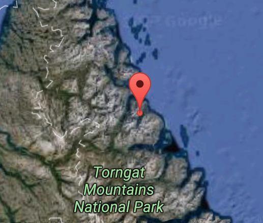
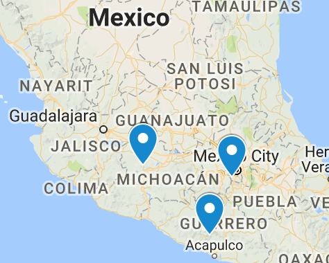

# Project 2 - Spatiotemporal Analysis with MapReduce <br> by: Melanie Baybay

Project Specification: https://www.cs.usfca.edu/~mmalensek/courses/cs686/projects/project-2.html

## Warm-up
* [0.5 pt] **How many records are in the dataset?** 
    * **nam_2015: 323759744**
* [0.5 pt] **Are there any Geohashes that have snow depths greater than zero for the entire year? List them all.** 
    * **823 geohashes** [see results](https://github.com/cs686-bigdata/p2-mbaybay/blob/master/results/snow_output.txt)
    * **3 Examples:**
        * c3jtjguxeg7z = (51.52581, -115.75661) = Jasper National Park, near Calgary, Alberta, Canada
        
        
        * fdddc48rnw5b = (59.560867, -63.939804) = near Tourngat Mountains National Park in Northern Canada
        
        
        * 9wgymmmh2rrz = (39.096985, -106.98897) = near Sleeping Sexton Mountain in Colorado, US.
        
        
        
* [0.5 pt] **When and where was the hottest temperature observed in the dataset? Is it an anomaly?** 
    * **(21.027893, -87.07605)	2015-08-22	331.39062**
    * **Location:** (21.027893, -87.07605), region near Cancun, Mexico
    * **Date:** 2015-08-22
    * **Temperature:** 331.39062 K = 136.83&deg;F = 58.24&deg;C
    
    * I don't think it's is an anomaly, since the max air temperature in Cancun was around 91&deg;F that day according to 
    [WeatherUnderground](https://www.wunderground.com/history/airport/MMUN/2015/8/22/DailyHistory.html?req_city=&req_state=&req_statename=&reqdb.zip=&reqdb.magic=&reqdb.wmo=). 
    Since this value depicts surface temperature, it's expected to be higher than the recorded air temperature.   

---

## Analysis
* [1 pt] **Where are you most likely to be struck by lightning? Use a precision of 4 Geohash characters and provide the top 3 locations.** [see results](https://github.com/cs686-bigdata/p2-mbaybay/blob/master/results/light_output.txt)
    * **Top 3:** (17.490234, -100.01953)	2280, (19.248047, -99.31641)	2271, (19.59961, -102.12891)	2237
    * **Top Locations (in order):**  
        * Los Bajos, Guerrero, Mexico
        * Magdalena Contreras, Mexico City, Mexico
        * Uruapan, Michoacán, Mexico
        
    
* [1.5 pt] **What is the driest month in the bay area? This should include a histogram with data from each month. (Note: how did you determine what data points are in the bay area?)**
    * To identify the geohash-prefixes for the Bay Area, I created a function that encodes upper and lower coordinates of the Bay Area to into its respective geohash prefixes. (see [*initBayAreaGeoList()* in Bay Area Mapper](https://github.com/cs686-bigdata/p2-mbaybay/blob/master/src/main/java/edu/usfca/cs/mr/bayarea/BayAreaMapper.java))
    * **Driest Month:** November 2015, with 12.67 kg/m2 average precipitation
    
* [3 pt] **After graduating from USF, you found a startup that aims to provide personalized travel itineraries using big data analysis. Given your own personal preferences, build a plan for a year of travel across 5 locations. Or, in other words: pick 5 regions. What is the best time of year to visit them based on the dataset?**
    * This mapreduce job focuses on identifying the avg. rain percentage and temperature for each month in a given region. I wrote an additional [python script](pyScripts/travel_plan.py) that schedules the 5 regions in to a full year travel plan.  

|Month|Geo-Prefix|Rain(%)|Temp(F&deg;)|
|:---|:---:|---:|---:|
|01-2015| d79| 0.0 |73.65|
|02-2015| d79| 0.0 |90.78|
|03-2015| 9wg| 0.0 |68.72|
|04-2015| 9wg| 0.0 |70.73|
|05-2015| f25| 0.0 |72.09|
|06-2015| f25| 0.0 |86.33|
|07-2015| f25| 0.0 |85.86|
|08-2015| c3j| 0.0| 78.20|
|09-2015| c3j| 0.0|78.16|
|10-2015| dr5| 0.0| 72.98|
|11-2015| dr5| 0.0| 76.93|
|12-2015| dr5| 0.0| 69.98|

* [3 pt] **Your travel startup is so successful that you move on to green energy; here, you want to help power companies plan out the locations of solar and wind farms across North America. Write a MapReduce job that locates the top 3 places for solar and wind farms, as well as a combination of both (solar + wind farm). You will report a total of 9 Geohashes as well as their relevant attributes (for example, cloud cover and wind speeds).**
    * To tackle this problem, I stacked two mapreduce jobs: 
        * Job #1: Calculate average annual wind speeds, vegetation, and cloud cover for a geohash region (precision 5 for solar, precision 4 for wind). Output all viable solar, wind, and solar+wind farms for the data. 
        * Job #2: Filter the each category (solar, wind, solar+wind) to identify the top 3 in each. 
          
    * Unfortunately, running this job with the full dataset on the cluster produced a memory error:
        
        ```
        INFO mapreduce.Job: Job job_1510467065584_0361 failed with state KILLED due to: MAP capability required is more than the supported max container capability in the cluster. Killing the Job. mapResourceRequest: <memory:1024, vCores:1> maxContainerCapability:<memory:658, vCores:2>
        ``` 
        
    * Similarly, running this job with the 30% dataset on my local machine gives the following: 
       
        ```
        java.lang.Exception: org.apache.hadoop.mapreduce.task.reduce.Shuffle$ShuffleError: error in shuffle in localfetcher#1
          ...
          Caused by: org.apache.hadoop.mapreduce.task.reduce.Shuffle$ShuffleError: error in shuffle in localfetcher#1
          ...
          Caused by: java.lang.OutOfMemoryError: Java heap space
        ```
        
    * Thus, here is the [result for the mini dataset](results/green_energy_mini.txt): 
        
        |Farm Type|Geo|Avg. Cloud Cover(%)|
        |---|---|---|
        |SOLAR|dqbnn|0.0|
        |SOLAR|dqbnw|0.0|
        |SOLAR|dqbh6|0.0|
        
        |Farm Type|Geo|Avg. Wind Speed(m/s)|Avg. Vegetation(%)|Avg. Cloud Cover(%)|
        |---|---|---|---|---|
        |SOLAR+WIND|9s5g|19.403782894870897|0.0|0.0|
        |SOLAR+WIND|9s5f|19.359126132022386|0.0|0.0|
        |SOLAR+WIND|9s5t|14.853132104652602|0.0|0.0|
        
        |Farm Type|Geo|Avg. Wind Speed(m/s)|Avg. Vegetation(%)|
        |---|---|---|---|
        |WIND|9k99|19.990707464057756|0.0|
        |WIND|9k98|19.98175662403502|0.0|
        |WIND|9m3k|19.955749584766618|0.0|
    
    * **Resources:**
        * [Wind Speed Calc #1](http://colaweb.gmu.edu/dev/clim301/lectures/wind/wind-uv.html)
        * [Wind Speed Calc #2](https://www.ncl.ucar.edu/Document/Functions/Contributed/wind_speed.shtml)
        * [3.25MW by 2030 in North America](https://emp.lbl.gov/news/future-wind-energy-part-3-reducing-wind)
        * [~4MW per km2](https://sciencing.com/much-land-needed-wind-turbines-12304634.html)
        * [1.8MW per 155 acres (0.627 km2 = 0.242 mi2)](https://www.saskwind.ca/land-area/)
        * [List of Wind Farms in the US](https://en.wikipedia.org/wiki/List_of_wind_farms_in_the_United_States)
        * [Trophosphere Boundary Layer](https://www.niwa.co.nz/education-and-training/schools/students/layers)
* [2 pt] **Given a Geohash prefix, create a climate chart for the region. This includes high, low, and average temperatures, as well as monthly average rainfall.** 
 
    * The following result is for geohash-prefix *dr5*, which represent the New York region. The plot was generated using a modified version of [@malensek's climate_chart.py script](https://github.com/malensek/climate-chart): 

